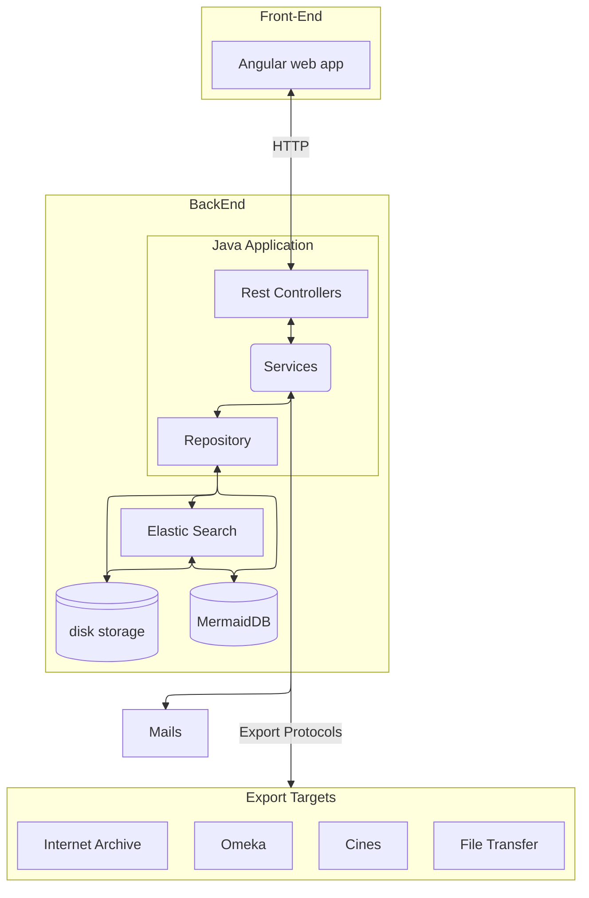

# Documentation Technique de Numahop

## Build NumaHOP
### MakeFile
Pour build NumaHOP on peut utiliser le make file. 
```bash
make build
```
Il est aussi possible de build une image docker:
```bash
make docker-build
```
Cependant le makefile permet de gerer la composition des images plus facilement avec les commandes de la forme:
```bash
make <target>-<action>
```
Il y a 3 targets disponible:
- `env`: Target uniquement les images pour MariaDB, le serveur de mail et ElasticSearch.
- `app`: Target uniquement l'image de numahop.
- `all`: `env` et `app` reunis.

Il y a 5 action que l'ont peut lancer: 
- `up`: Lance les images.
- `logs`: Affiche les logs.
- `stop`: Stop les images.
- `down`: Supprime les images du registre local.
- `clean`: Supprime les images du registre local et les volumes attaches.

### Maven + Docker
TODO: Explain more in depth how to build without the make file.

## Architecture de NumaHOP
TODO: Mermaid graph explaining the architecture.


# Configuration de NumaHOP
Toute la configuration de numahop se fait depuis un fichier appelé `application.yml`.

Certains services du back-end de NumaHOP peuvent se configurer dynamiquement. Ces services on des routes http ou il est possible de telecharger et modifier leurs configuration respectives.

## application.yml
Toute les utilisation des options peuvent facilement se retrouver dans le code java avec: `grep -e "@Value\(\$\{.*\}\)"`.

### Logs
```yaml
loging:
    file:
        name: <path>
    warnDuration:
```
<details>
	<summary>Utilisations</summary>
    <ul>
        <li>src/main/java/fr/progilone/pgcn/config/LoggingAspectConfiguration.java</li>
        <li>src/main/java/fr/progilone/pgcn/service/administration/logs/AdminLogsService.java</li>
    </ul>
</details>

### Ssh Forwarding

```yaml
sshForwarding:
    enabled:
    strictHostKeyChecking:
    knownHosts:
    server:
    port:
    user:
    password:
    elasticsearch:
        remoteServer:
        localPort:
        remotePort:
    database:
        remoteServer:
        localPort:
        remotePort:
```
<details>
	<summary>Utilisations</summary>
    <ul>
        <li>src/main/java/fr/progilone/pgcn/config/SshPortForwardingConfigurer.java</li>
    </ul>
</details>

## Instance
Dans section instance on peut configurer les differentes libraries presentes sur cette instance de NumaHOP.
```yaml
instance:
    libraries: lib1, lib2, lib3
```

<details>
	<summary>Utilisations</summary>
    <ul>
        <li>src/main/java/fr/progilone/pgcn/config/BinaryStorageConfiguration.java</li>
        <li>src/main/java/fr/progilone/pgcn/service/delivery/DeliveryReportingService.java</li>
        <li>src/main/java/fr/progilone/pgcn/service/check/MetaDatasCheckService.java</li>
        <li>src/main/java/fr/progilone/pgcn/service/document/ui/UIDocUnitService.java</li>
        <li>src/main/java/fr/progilone/pgcn/service/exchange/cines/CinesRequestHandlerService.java</li>
        <li>src/main/java/fr/progilone/pgcn/service/exchange/cines/ExportCinesService.java</li>
        <li>src/main/java/fr/progilone/pgcn/service/exchange/cines/ExportSipService.java</li>
        <li>src/main/java/fr/progilone/pgcn/service/exchange/omeka/OmekaService.java</li>
        <li>src/main/java/fr/progilone/pgcn/service/exchange/digitallibrary/DigitalLibraryDiffusionRequestHandlerService.java</li>
        <li>src/main/java/fr/progilone/pgcn/service/storage/FileCleaningManager.java</li>
        <li>src/main/java/fr/progilone/pgcn/service/storage/AltoService.java</li>
        <li>src/main/java/fr/progilone/pgcn/service/storage/FileStorageManager.java</li>
    </ul>
</details>

## Services
```yaml
services:
    deliveryreporting.path:
    cines:
        aip:
        cache:
        facile:
        updating:
            cronenabled:
        xsd:
            sip:
    metaDatas:
        path:
    ftpexport:
        cache:
    omeka:
        cache:
    digitalLibraryDiffusion:
        cache:
    archive:
        alto:
        text:
```

<details>
	<summary>Utilisations</summary>
    <ul>
        <li>src/main/java/fr/progilone/pgcn/service/delivery/DeliveryReportingService.java</li>
        <li>src/main/java/fr/progilone/pgcn/service/check/MetaDatasCheckService.java</li>
        <li>src/main/java/fr/progilone/pgcn/service/check/FacileCinesService.java</li>
        <li>src/main/java/fr/progilone/pgcn/service/document/ui/UIDocUnitService.java</li>
        <li>src/main/java/fr/progilone/pgcn/service/exchange/internetarchive/InternetArchiveService.java</li>
        <li>src/main/java/fr/progilone/pgcn/service/exchange/cines/CinesRequestHandlerService.java</li>
        <li>src/main/java/fr/progilone/pgcn/service/exchange/cines/ExportCinesService.java</li>
        <li>src/main/java/fr/progilone/pgcn/service/exchange/cines/ExportSipService.java</li>
        <li>src/main/java/fr/progilone/pgcn/service/exchange/omeka/OmekaService.java</li>
        <li>src/main/java/fr/progilone/pgcn/service/exchange/digitallibrary/DigitalLibraryDiffusionRequestHandlerService.java</li>
        <li>src/main/java/fr/progilone/pgcn/service/exchange/digitallibrary/DigitalLibraryDiffusionService.java</li>
        <li>src/main/java/fr/progilone/pgcn/service/storage/FileCleaningManager.java</li>
        <li>src/main/java/fr/progilone/pgcn/service/storage/AltoService.java</li>
    </ul>
</details>

## ElasticSearch
```yaml
elasticsearch:
    bulk_size:
```

<details>
	<summary>Utilisations</summary>
    <ul>
        <li>src/main/java/fr/progilone/pgcn/service/es/EsDeliveryService.java</li>
        <li>src/main/java/fr/progilone/pgcn/service/es/EsConditionReportService.java</li>
        <li>src/main/java/fr/progilone/pgcn/service/es/EsTrainService.java</li>
        <li>src/main/java/fr/progilone/pgcn/service/es/EsLotService.java</li>
        <li>src/main/java/fr/progilone/pgcn/service/es/EsDocUnitService.java</li>
        <li>src/main/java/fr/progilone/pgcn/service/es/EsProjectService.java</li>
        <li>src/main/java/fr/progilone/pgcn/service/exchange/AbstractImportService.java</li>
    </ul>
</details>

## Report

<details>
	<summary>Utilisations</summary>
    <ul>
        <li>src/main/java/fr/progilone/pgcn/service/JasperReportsService.java</li>
    </ul>
</details>

## Upload Path
```yaml
uploadPath:
    library:
    user:
    library:
    condition_report:
    template:
    import:
    ead:
```

<details>
	<summary>Utilisations</summary>
    <ul>
        <li>src/main/java/fr/progilone/pgcn/service/JasperReportsService.java</li>
        <li>src/main/java/fr/progilone/pgcn/service/user/UserService.java</li>
        <li>src/main/java/fr/progilone/pgcn/service/library/LibraryService.java</li>
        <li>src/main/java/fr/progilone/pgcn/service/document/conditionreport/ConditionReportAttachmentService.java</li>
        <li>src/main/java/fr/progilone/pgcn/service/exchange/ead/ExportEadService.java</li>
        <li>src/main/java/fr/progilone/pgcn/service/exchange/ImportReportService.java</li>
        <li>src/main/java/fr/progilone/pgcn/service/exchange/template/TemplateService.java</li>
    </ul>
</details>

## Admin
```yaml
admin:
    login:
    password:
```

<details>
	<summary>Utilisations</summary>
    <ul>
        <li>src/main/java/fr/progilone/pgcn/service/user/ui/UIUserService.java</li>
        <li>src/main/java/fr/progilone/pgcn/web/rest_int/InternalAccountResource.java</li>
        <li>src/main/java/fr/progilone/pgcn/security/UserDetailsService.java</li>
    <ul>
</details>

## Images
```yaml
images:
    format:
        default:
            thumbHeight:
            thumbWidth:
            viewHeight:
            viewWidth:
            printHeight:
            printWidth:
```

<details>
	<summary>Utilisations</summary>
    <ul>
        <li>src/main/java/fr/progilone/pgcn/service/util/DefaultFileFormats.java</li>
    </ul>
</details>

## Export
```yaml
export:
    rdf:
        default_uri:
        knownHosts:
        privateKey:
        strictHostKeyChecking:
```

<details>
	<summary>Utilisations</summary>
    <ul>
        <li>src/main/java/fr/progilone/pgcn/service/exchange/dc/DocUnitToJenaService.java</li>
        <li>src/main/java/fr/progilone/pgcn/service/exchange/ssh/SftpService.java</li>
    </ul>
</details>

## Crypto
```yaml
crypto:
    password:
    salt:
```

<details>
	<summary>Utilisations</summary>
    <ul>
        <li>src/main/java/fr/progilone/pgcn/service/util/CryptoService.java</li>
    </ul>
</details>

## ExifTool
```yaml
exifTool:
    quot_char:
```

<details>
	<summary>Utilisations</summary>
    <ul>
        <li>src/main/java/fr/progilone/pgcn/service/storage/ExifToolService.java</li>
        <li>src/main/java/fr/progilone/pgcn/service/storage/ImageMagickService.java</li>
    </ul>
</details>

## Server
```yaml
server:
    port:
```

<details>
	<summary>Utilisations</summary>
    <ul>
        <li>src/main/java/fr/progilone/pgcn/web/rest/administration/HealthController.java</li>
    </ul>
</details>

## Info
```yaml
info:
    build:
    artifact:
    name:
    description:
    version:
```

<details>
	<summary>Utilisations</summary>
    <ul>
        <li>src/main/java/fr/progilone/pgcn/web/rest/NumahopController.java</li>
    </ul>
</details>

### Spring.
```yaml
spring:
    mail:
        from:
        activated:
```

<details>
    <summary> Utilisations </summary>
    <ul>
        <li>src/main/java/fr/progilone/pgcn/service/MailService.java</li>
        <li>src/main/java/fr/progilone/pgcn/service/document/DigitalDocumentService.java</li>
    </ul>
</details>

### Cron jobs.
Certain services sont annotees avec `@Scheduled` dans le code. Ce sont des cron jobs qui peuvent etre configures dans le fichier yml:
```
cron:
    <name>: 0 0 0 * * ?
```
A les cron jobs configurable sont:
- removeOldTokens:
- cleanLocks:
- rebuildIndex: Reconstruit l'index de elastic search.
- cleanDeliveryFiles: 
- cinesExport: Lance l'export des unitees documentaires vers le cines.
- localExport:
- cleanTemporaryFiles:
- internetArchiveExport: 
- gestDeliveredFiles:
- cinesUpdateStatus:
- omekaExport:
- cleanExportCaches:
- docUnitUpdateArk:
- digitalLibraryExport:


### Config dynamique.
D'autres services on une partie de la configuration qui est dynamique cela comprends des cles ssh et autres tokens d'identification.
TODO: Documenter les service configurable dynamiquement.

# Organization du code.
## Back-End. 
_[Liste des dependances java.](../gen/deps.md)_

La racine du code backend est `src/main/java/fr/progilone/pgcn`.

Dans la racine on trouve ces repertoires: 
- `domain`: Modele des donnees. 
    - _DTO: Data Transfer Object_ Dans l'architecture MVC (Model View Controller) le DTO est l'objet de representation envoye par le _Controller_ que la _View_ doit afficher.
    - Dossier jaxb: Les classes jaxb sont des classes auto generees par les fichier xml. La plupart sont liees a des formats de metadonnes pour l'archivage.
- `repositories`: Abstraction de l'acces des donnees. Normalise les exception.
- `services`: Buisness logic.
- `security`: 
- `web`: REST Api
- `config`:

Dans ces dossier a la racine du code on retrouve des dossier concernant les fonctionalitees des modules:
- `es`: ElasticSearch.
- `user`: Module de gestion des utilisateurs et de leurs droit (different de l'authentification).
- `lot`: Module de gestion des lot. 
- `library`: Module de gestion des libraries. 
- `*configuration`: Modules de gestion des configuration dynamique.
- `document`: Module de gestion des documents.
- `train`: Module de gestion des trains de numerisation.
- `workflow`: Module de gestion des workflow.
- ``:

## Front-End
Le code du front-end se trouve a `src/main/webapp`.

# L'archivage et les metadonnes.

## Formats de metadonnees

SIP (_Submission Information Package_) Decris un fichier avant archivation avec les metadonnes. 

AIP (_Archival Information Package_) Decris un fichier apres archivation et les metadonnes accessibles. 

METS (_Metadata Encoding & Transmission Standard_) [Spec](https://www.loc.gov/standards/mets/)

MARC Format pour les donnees bibliographiques. [Spec](https://www.loc.gov/marc/bibliographic/)

DC (_Dublin core_) Ensemble de quinze element pour decrire des resources. [Guide Utilisateur](https://www.dublincore.org/resources/userguide/)

ALTO (_Analyzed Layout and Text Object_)

EAD (_Encoded Archival Description_)

Tous ces formats sont des documents xml avec des schema en XSD (_XML Schema Definition_). [SPEC](https://www.w3.org/TR/xmlschema11-1/)

## Protocols.

OAI-PMH (_Open Archive Protocol for Metadata_) [Spec](https://www.openarchives.org/OAI/openarchivesprotocol.html)
