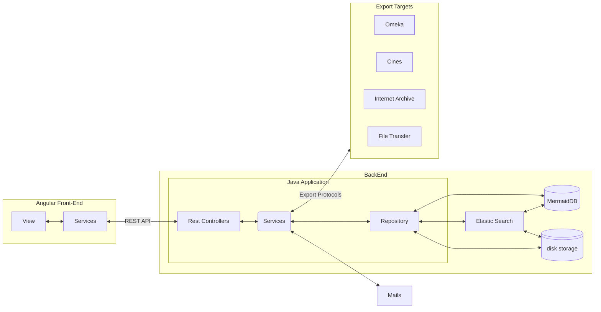

# NumaHOP Architecture

```mermaid
flowchart LR

    subgraph fr[Angular Front-End]
        direction TB
        fr-view[View] 
        fr-ser[Services]
    end

    smtp[Mails]
    subgraph be[BackEnd]
        direction LR
        subgraph java[Java Application]
            direction LR;
            cont[Rest Controllers]
            ser(Services)
            rep[Repository]
        end
        es[Elastic Search]
        db[("MermaidDB")]
        fs@{ shape: lin-cyl, label: "disk storage"}
    end
    subgraph exp[Export Targets]
        direction LR
        omeka[Omeka]
        cines[Cines]
        archive[Internet Archive]
        sftp[File Transfer]
    end
    fr-view <--> fr-ser
    fr-ser <--> |REST API| cont

    cont <--> ser 

    ser <--> smtp
    ser <--> rep 
    ser <--> |Export Protocols| exp

    rep <--> db
    rep <--> es <--> db & fs
    rep <--> fs
```
