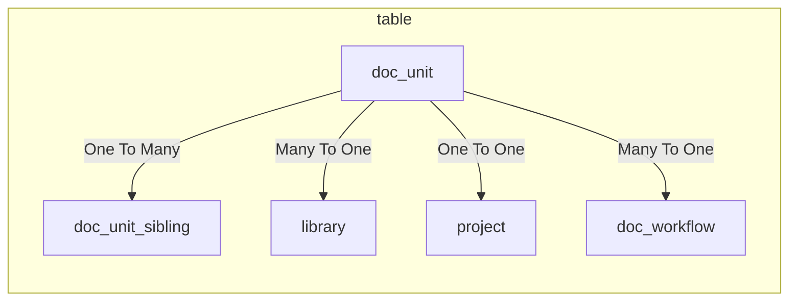

# The DocUnit Module

This module manages document units.

## Module files

Domain Objects:

Services:

Controllers:

Manages document units.

## Database Tables
- [`doc_unit`](../db.md#doc_unit)
- [`doc_unit_sibling`](../db.md#doc_unit_sibling)
- [`doc_workflow`](../db.md#doc_workflow) 
- [`doc_workflow_state`](../db.md#doc_workflow_state) 
- [`doc_property`](../db.md#doc_property)
- [`doc_property`](../db.md#doc_property_type)

