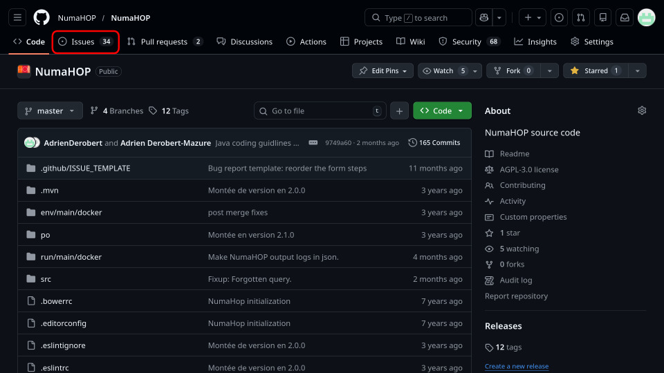
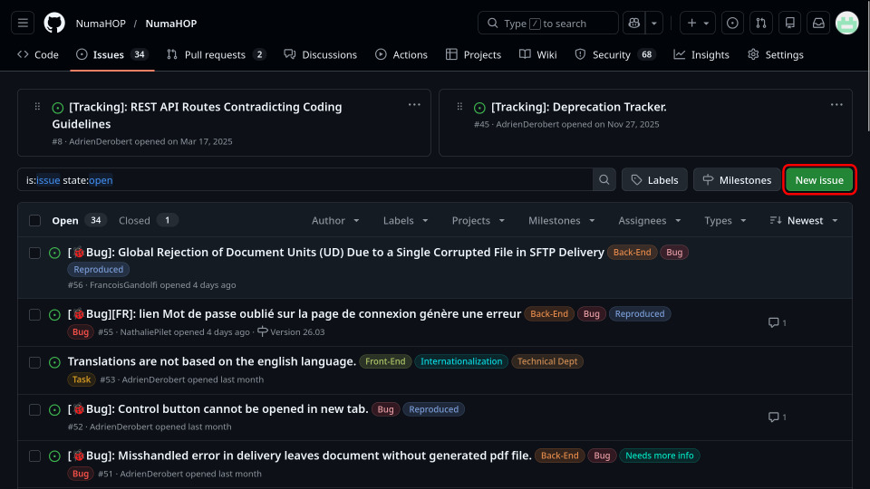
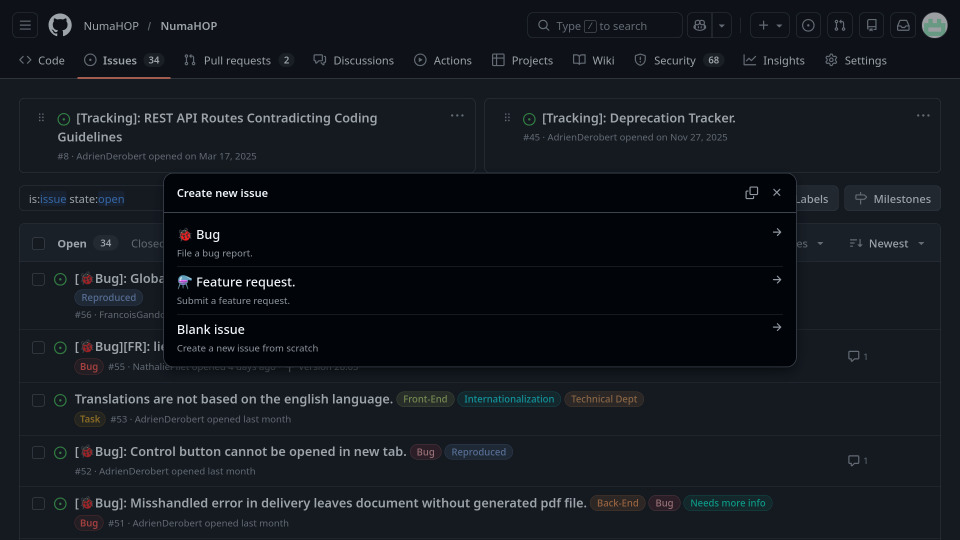

# GitHub for the NumaHOP user.

The NumaHOP community principally works on GitHub. An organisation is available
for people managing the NumaHOP releases and the documentation. Under the
NumaHOP organisation there is 2 active repositories:
- [github.com/NumaHOP/NumaHOP](https://github.com/NumaHOP/NumaHOP) contains the
  source code for NumaHOP
- [github.com/NumaHOP/Documentation](https://github.com/NumaHOP/Documentation)
  contains the source of the developper manual and the user manual

## How To Report a Bug

If you found a bug inside NumaHop and want to report it you can create an issue
on the numahop code repository.

> If you don't have a github account you will need to create one as it is
> needed to create issues.

Once logged into github navigate to the NumaHOP [repository](https://github.com/NumaHOP/NumaHOP).
Then click on the issue tab to access the list of issues.

> Before creating an issue please spend a bit of time to search existing ones
> if the bug was already reported.

Then click on the button labeled __New issue__.

There are 3 options proposed to you:

If you are not familiar with the markdown syntax I would advise you to select
the __Bug__ option. As it propose you to simply fill a form with several
questions asked. Otherwise if you know the markdown syntax and are
familiar with the information needed inside a bug report you can use the __Blank
Issue__ option.

Then fill out the form sections:
- __Steps to reproduce__ should describe the prerequisites and the steps to
  perform to reproduce the bug.
- __Current Behavior__ should describe what is currently happening when the bug
  is triggered.
- __Expected Behavior__ should describe what is you expected should happen
  instead.
- __Browser__ if the bug is occuring in the interface you must fill out the
  browser you used when you encountered the bug.
- __Anything else ?__ is a section to link additional informations that should be
  usefull to help resolve the bug.

> Note: you can link files and images (screenshots) by dragging them in any of
> the textareas.

## How To Make A Feature Request

> ToDo 
